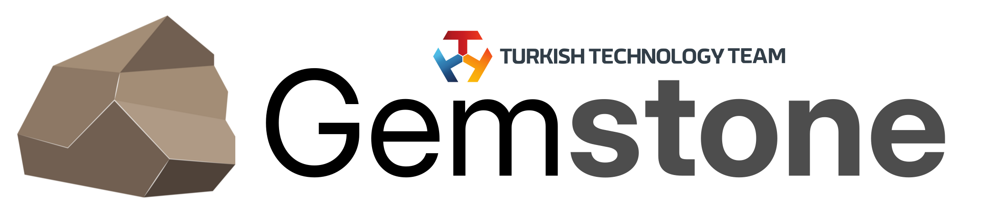

<p align="center">
    <picture>
        <source media="(prefers-color-scheme: dark)" srcset=".meta/logo-dark.png" width="40%" />
        <source media="(prefers-color-scheme: light)" srcset=".meta/logo-light.png" width="40%" />
        
    </picture>
</p>

# TI AM67A EdgeAI

 [](https://www.t3vakfi.org/en) [](https://opensource.org/licenses/Apache-2.0) [](https://www.jetify.com/devbox/docs/contributor-quickstart/) [](https://docs.t3gemstone.org)

## What is it?

This repository contains the build system and packaging scripts for the **TI AM67A EdgeAI**. It automates the end-to-end process of compiling, patching, and packaging all software components required to run AI inference workloads on T3 Gemstone boards.

The scripts handle the full pipeline for the following components:

- **TensorFlow Lite** — static library and Python wheel for aarch64
- **ONNXRuntime** — shared library and Python wheel with TIDL execution provider
- **TI TIDL Runtime** — TIDL-RT, TFLite-RT delegate, and ONNX-RT EP libraries
- **GStreamer** — multimedia framework with TI-specific downstream patches
- **DLR (Deep Learning Runtime)** — Neo-AI DLR library and Python wheel
- **v4l2-utils** — V4L2 camera utilities
- **ti-rpmsg-char** — RPMsg character device library for heterogeneous core communication
- **EdgeAI App Stack** — demo applications, test data, model zoo, and environment setup

All components are packaged as `.deb` files and/or Python `.whl` files, ready to be deployed on the target device.

This repository is intended for developers who want to build the SDK from source, customize individual components, or integrate new versions of upstream libraries into the T3 Gemstone software stack.

For pre-built binaries and full documentation, visit [https://docs.t3gemstone.org/en/boards/o1/ai/introduction](https://docs.t3gemstone.org/en/boards/o1/ai/introduction).

##### 1. Install Docker and jetify-devbox on the host computer.

```bash
user@host:$ ./setup.sh
```

<a name="section-ii"></a>
##### 2. After the installation is successful, activate the jetify-devbox shell to automatically install tools such as Docker, taskfile, etc.

```bash
user@host:$ devbox shell
```

##### 3. Create a Docker image, and enter it.

```bash
root@host:~ task box
```

##### 4. Build the Deb and WHL packages

```bash
# Show all available tasks and environment variables
root@host:~ task default

# Builds all .deb and .whl packages
root@host:~ task build:init
root@host:~ task build:all
```
### Screencast

[](https://asciinema.org/a/KDwPPlCV2wxzpwDB4sLseW2X9)

# Troubleshooting

#### 1. First Installation of Docker

Docker is installed on your system via the `./setup.sh` command. If you are installing Docker for the first time,
you must log out and log in again after the installation is complete.

#### 2. Removal of Docker Image

To remove a Docker image, execute the destroy command.

```bash
root@host:~ task destroy
```
